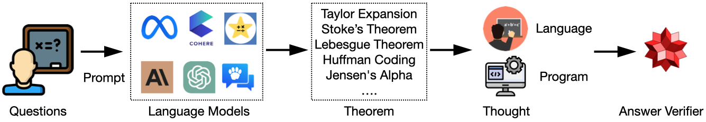
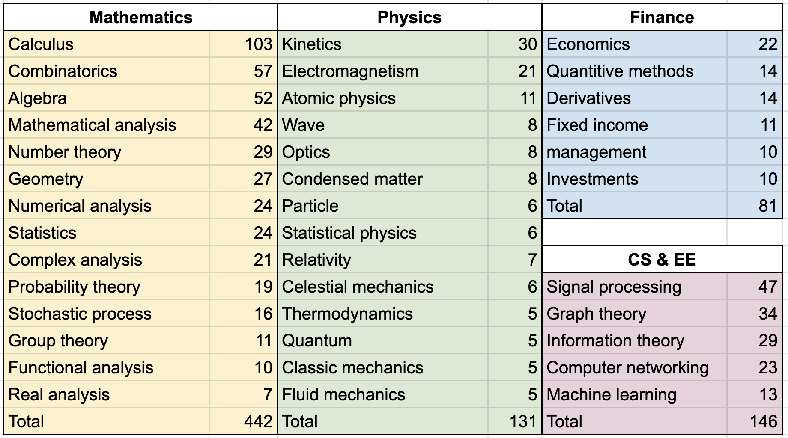
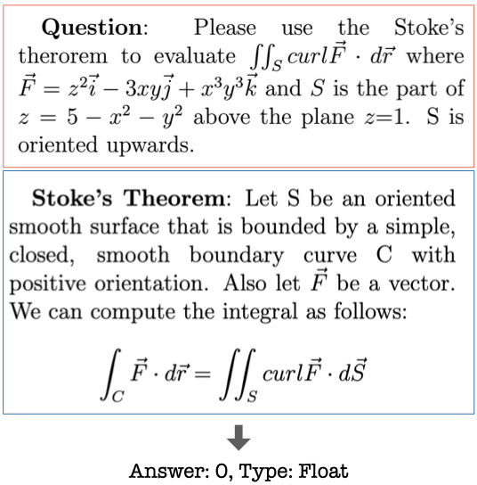
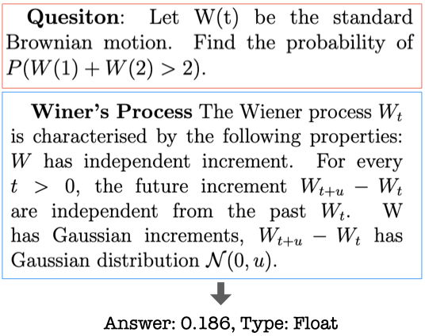

# TheoremQA
The official repo for [TheoremQA: A Theorem-driven Question Answering dataset](https://arxiv.org/abs/2305.12524) (EMNLP 2023)

The leaderboard is displayed in https://huggingface.co/spaces/TIGER-Lab/Science-Leaderboard

## Introduction
We propose the first question-answering dataset driven by STEM theorems. We annotated 800 QA pairs covering 350+ theorems spanning across Math, EE&CS, Physics and Finance. The dataset is collected by human experts with very high quality. We provide the dataset as a new benchmark to test the limit of large language models to apply theorems to solve challenging university-level questions. We provide a pipeline in the following to prompt LLMs and evaluate their outputs with WolframAlpha.
<p align="center">

</p>

The dataset covers a wide range of topics listed below:
<p align="center">

</p>

## Examples
<p align="center">

</p>

<p align="center">

</p>

## Huggingface
Our dataset is on Huggingface now: https://huggingface.co/datasets/TIGER-Lab/TheoremQA
```
from datasets import load_dataset
dataset = load_dataset("wenhu/TheoremQA")
```

## Running Instruction (5-shot ICL)
```
mkdir outputs
python run.py --model [YOUR_MODEL_HF_LINK] --form short
```


## Cite our Work
```
@inproceedings{chen2023theoremqa,
  title={Theoremqa: A theorem-driven question answering dataset},
  author={Chen, Wenhu and Yin, Ming and Ku, Max and Lu, Pan and Wan, Yixin and Ma, Xueguang and Xu, Jianyu and Wang, Xinyi and Xia, Tony},
  booktitle={The 2023 Conference on Empirical Methods in Natural Language Processing},
  year={2023}
}
```
